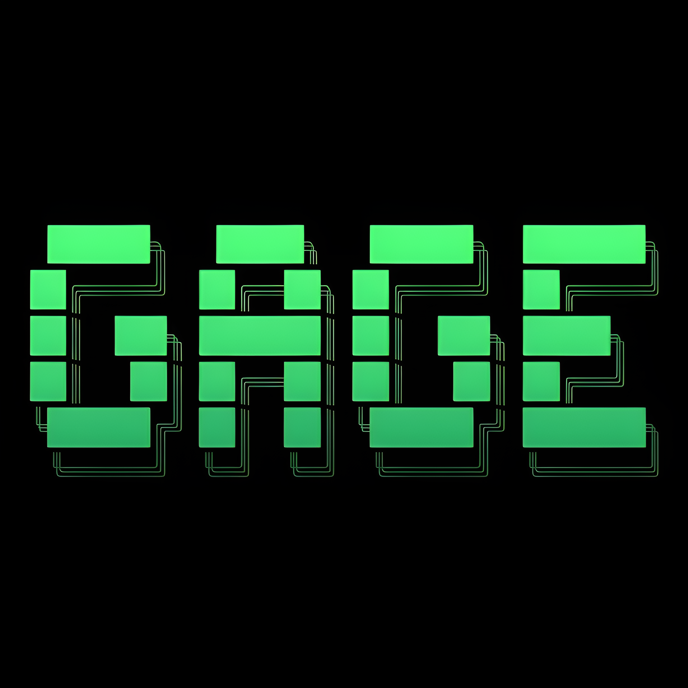

# GAGE

<h3>A compact, native-oriented programming language built in Rust.</h3>

<b>Expressive syntax</b> · <b>Native C code generation</b> · <b>Bytecode VM</b> · <b>Vector mathematics</b> · <b>Simulation-oriented design</b>

---

## Overview

GAGE is an experimental programming language and compiler toolchain implemented in Rust.

The project contains its own lexer, parser, abstract syntax tree, semantic analysis and type-checking system, native C code generator, bytecode compiler, bytecode representation, virtual machine, command-line interface, and interactive REPL.

GAGE is designed around a compact programming model with support for functions, classes, mutable state, dynamic arrays, vector mathematics, terminal I/O, file I/O, control flow, and simulation-oriented programming.

The project provides two primary execution paths:

- **Native execution** — GAGE source is lexed, parsed, semantically checked, translated into C, and compiled through Clang.
- **Bytecode execution** — GAGE source is lexed, parsed, semantically checked, compiled into bytecode, and executed by the built-in virtual machine.

Both execution paths share the same front end before diverging into their respective backends.

---

## Compiler Architecture

A GAGE program moves through a traditional compiler pipeline:

    GAGE Source (.gage)
            │
            ▼
        ┌─────────┐
        │  Lexer  │
        └────┬────┘
             │
             ▼
        ┌─────────┐
        │ Parser  │
        └────┬────┘
             │
             ▼
        ┌─────────┐
        │   AST   │
        └────┬────┘
             │
             ▼
      ┌──────────────┐
      │ Type Checker │
      └──────┬───────┘
             │
        ┌────┴────┐
        │         │
        ▼         ▼
   ┌────────┐  ┌──────────────┐
   │ CodeGen│  │   Compiler   │
   │  AST→C │  │ AST→Bytecode│
   └────┬───┘  └──────┬───────┘
        │             │
        ▼             ▼
     ┌───────┐     ┌──────┐
     │ Clang │     │  VM  │
     └───┬───┘     └──┬───┘
         │            │
         └─────┬──────┘
               ▼
            Execution

The front end is responsible for understanding the GAGE language itself.

The backend determines how the validated program is ultimately executed.

---

## ✨ Core Features

### 🦀 Rust-Based Compiler

GAGE is implemented in Rust and separates the compiler into focused components.

The source tree contains dedicated modules for:

- Token definitions
- Lexical analysis
- Abstract syntax tree construction
- Parsing
- Semantic analysis
- Type checking
- Native code generation
- Bytecode generation
- Bytecode execution
- Command-line handling
- Interactive REPL functionality

This separation makes the compiler easier to understand, debug, extend, and experiment with.

---

### ⚡ Native Code Generation

The native backend translates GAGE programs into C source code.

The native pipeline is:

    .gage source
         │
         ▼
       Lexer
         │
         ▼
       Parser
         │
         ▼
        AST
         │
         ▼
     Type Checker
         │
         ▼
      CodeGen
         │
         ▼
     Generated C
         │
         ▼
       Clang
         │
         ▼
   Native Executable

The native code generator is primarily implemented in:

    src/codegen.rs

The generated C runtime provides support for GAGE-specific functionality such as:

- Primitive values
- Strings
- Vectors
- Dynamic arrays
- Classes
- Methods
- Terminal input/output
- File operations
- Vector mathematics
- Runtime validation

The resulting C source can then be compiled by Clang into a native executable.

---

## 🚀 Bytecode Virtual Machine

GAGE also contains a custom bytecode execution system.

The bytecode implementation is distributed across:

    src/bytecode.rs
    src/compiler.rs
    src/vm.rs

The bytecode pipeline is:

    .gage source
         │
         ▼
       Lexer
         │
         ▼
       Parser
         │
         ▼
     Type Checker
         │
         ▼
   Bytecode Compiler
         │
         ▼
       Bytecode
         │
         ▼
   Virtual Machine
         │
         ▼
      Execution

The VM uses a stack-oriented execution model and maintains runtime state including:

- Evaluation stack
- Global variables
- Constants
- Instruction pointer
- Bytecode instructions
- Runtime values

The bytecode representation includes concepts such as:

    Value
    OpCode
    Chunk

The current VM value system includes:

    Nil
    Bool
    Int
    Float
    Str
    Vec2
    Vec3
    Vec4

The bytecode instruction set includes operations for areas such as:

    Constants
    Boolean values
    Nil
    Vectors
    Arithmetic
    Comparisons
    Unary operations
    Global variables
    Local stack slots
    Jumps
    Loops
    Printing
    Return
    Halt

The VM is an evolving execution backend and currently supports a smaller portion of the language than the native backend.

---

## 📐 Vector Mathematics

Vector types are integrated directly into GAGE.

The language provides:

    vec2
    vec3
    vec4

The native backend represents these vector types using C compiler vector extensions.

The native representation is based on:

    __attribute__((ext_vector_type(N)))

GAGE provides built-in mathematical operations including:

    dot()
    cross()
    length()
    normalize()

Example:

    let a = vec3(1.0, 0.0, 0.0);
    let b = vec3(0.0, 1.0, 0.0);

    let sum = a + b;
    let d = dot(a, b);
    let c = cross(a, b);
    let n = normalize(sum);

    println(sum);
    println(d);
    println(c);
    println(n);

Vector support makes GAGE suitable for experimenting with:

- Physics calculations
- Geometry
- Spatial mathematics
- Graphics-oriented calculations
- Simulation logic
- Game-oriented programming

---

## 🧱 Classes and Objects

GAGE provides a compact object-oriented programming model.

The language supports:

- Classes
- Fields
- Methods
- Object construction
- `new`
- `this`
- Member access
- Method calls
- Mutable object state

Example:

    class Player {
        health;
        power;

        fn setup(hp, attack) {
            this.health = hp;
            this.power = attack;
        }

        fn damage(amount) {
            this.health = this.health - amount;
        }
    }

    let player = new Player();

    player.setup(100, 25);
    player.damage(20);

    println(player.health);

The native backend lowers class definitions into native C structures and associated functions.

---

## 📦 Dynamic Arrays

GAGE supports dynamic array literals, indexing, mutation, and iteration.

Example:

    let scores = [450, 1200, 890, 2400];

    scores[0] = 500;

    for score in scores {
        println(score);
    }

The native runtime maintains dynamic-array information including:

    data
    length
    capacity

The backing storage can grow dynamically as required.

Array indexing is checked by the native runtime so invalid accesses can be reported instead of becoming unchecked memory accesses.

Conceptually:

    index < 0
        → runtime error

    index >= length
        → runtime error

    otherwise
        → access element

---

## 🔁 Control Flow

GAGE provides the fundamental control-flow constructs needed for general programming and simulation logic.

The language includes:

    if
    else
    while
    loop
    for ... in
    break
    step(dt)

### Conditional Execution

    let health = 75;

    if (health > 50) {
        println("Healthy");
    } else {
        println("Danger");
    }

### While Loop

    let i = 0;

    while (i < 10) {
        println(i);
        i = i + 1;
    }

### Collection Iteration

    let values = [10, 20, 30, 40];

    for value in values {
        println(value);
    }

---

## ⏱️ Simulation-Oriented `step(dt)`

GAGE includes a dedicated `step(dt)` construct intended for simulation-oriented programs.

Example:

    let position = vec3(0.0, 50.0, 0.0);
    let velocity = vec3(0.0, -1.0, 0.0);

    step(dt) {
        position = position + (velocity * dt);
    }

    println(position);

The `dt` value is introduced by the step block.

The current native implementation uses a fixed simulation timestep of approximately:

    0.016667

The construct provides a compact way to express simulation updates.

It is important to note that `step(dt)` is a language construct for simulation logic, not a complete real-time game-engine scheduler.

---

## 💻 Terminal I/O

GAGE provides basic terminal input and output.

Print without a newline:

    print("Hello ");

Print with a newline:

    println("GAGE!");

Read user input:

    let name = input("Enter your name: ");
    println(name);

These built-ins allow GAGE programs to interact directly with the terminal without requiring an external library.

---

## 💾 File I/O

GAGE includes basic filesystem operations.

Read a file:

    let data = read_file("save.txt");

    println(data);

Write a file:

    let success = write_file(
        "save.txt",
        "GAGE save data"
    );

    println(success);

This provides a simple persistence mechanism for small programs, experiments, and examples.

---

## 🧠 Functions

Functions are declared using `fn`.

Example:

    fn add(a, b) {
        return a + b;
    }

    let result = add(10, 20);

    println(result);

Functions can accept parameters and return values.

Recursive functions are also supported.

Example:

    fn factorial(n) {
        if (n <= 1) {
            return 1;
        }

        return n * factorial(n - 1);
    }

    println(factorial(5));

---

## 🧮 Expressions and Operators

GAGE supports expressions involving:

- Literals
- Variables
- Function calls
- Method calls
- Member access
- Array indexing
- Unary operations
- Binary operations
- Vector operations
- Comparisons
- Assignments

Example:

    let a = 10;
    let b = 20;

    let sum = a + b;
    let difference = b - a;
    let product = a * b;
    let quotient = b / a;

Vector expressions can also use supported vector operations:

    let a = vec3(1.0, 2.0, 3.0);
    let b = vec3(3.0, 2.0, 1.0);

    let c = a + b;

The complete syntax and operator reference is maintained separately in `DOCS.md`.

---

# 🔍 Compiler Front End

## Lexer

The lexer is implemented in:

    src/lexer.rs

It converts raw GAGE source characters into a stream of tokens.

The lexer recognizes language-level elements such as:

- Identifiers
- Keywords
- Integer literals
- Floating-point literals
- String literals
- Operators
- Punctuation
- Comments

It also tracks source information used when reporting lexical errors.

The lexer is the first stage that transforms raw source text into structured information that the parser can consume.

---

## Token Definitions

Token definitions are implemented in:

    src/token.rs

The token system provides the parser with structured representations of source-level syntax.

Tokens represent elements such as:

- Identifiers
- Literals
- Operators
- Keywords
- Delimiters
- Separators

The lexer produces these tokens and the parser consumes them.

---

## Parser

The parser is implemented in:

    src/parser.rs

It consumes the token stream produced by the lexer and constructs the GAGE abstract syntax tree.

The parser handles structures including:

- Variable declarations
- Assignments
- Expressions
- Functions
- Function calls
- Classes
- Object construction
- Member access
- Arrays
- Indexing
- Conditionals
- Loops
- Iteration
- `break`
- `step` blocks

The parser therefore transforms a flat token stream into a structured representation of the program.

---

## Abstract Syntax Tree

The AST is defined in:

    src/ast.rs

The abstract syntax tree acts as the central intermediate representation between parsing and the compiler backends.

It represents concepts such as:

- Literals
- Identifiers
- Vectors
- Arrays
- Object construction
- Member access
- Indexing
- Function calls
- Method calls
- Binary expressions
- Unary expressions
- Variable declarations
- Assignments
- Functions
- Classes
- Conditionals
- Loops
- Iteration
- `break`
- `step` blocks

Both the native code generator and bytecode compiler consume AST structures.

---

# 🧠 Type Checking and Semantic Analysis

Semantic analysis and type checking are implemented in:

    src/types.rs

The type checker validates program structure beyond basic syntax.

It maintains information about:

- Lexical scopes
- Variables
- Functions
- Function signatures
- Classes
- Class members

The type system includes concepts such as:

    Int
    Float
    Bool
    Str
    Vec2
    Vec3
    Vec4
    Array
    Custom
    Nil
    Any

The semantic stage can detect invalid programs before they reach an execution backend.

For example, references to undeclared variables can be rejected during semantic analysis instead of being left entirely to runtime behavior.

---

# ⚙️ Native Code Generation

Native code generation is implemented primarily in:

    src/codegen.rs

The code generator transforms validated GAGE AST nodes into C source code.

The generated program contains runtime support for GAGE-specific values and operations.

The backend handles concepts such as:

- Primitive values
- Strings
- Vectors
- Arrays
- Classes
- Methods
- Printing
- Input
- Files
- Vector mathematics
- Runtime checks

The resulting C source is passed to Clang.

---

# 🧮 Native Vector Representation

The native backend uses C vector extensions for GAGE vector types.

The representation is based on:

    __attribute__((ext_vector_type(N)))

This is used for:

    vec2
    vec3
    vec4

The backend also emits helper functionality for:

    dot
    cross
    length
    normalize

This allows vector operations to be lowered into native C operations rather than requiring an entirely separate high-level vector runtime.

---

# 📦 Native Array Runtime

The generated C runtime uses a dynamic array representation containing:

    data
    length
    capacity

This allows arrays to grow dynamically.

The runtime also validates array accesses.

Conceptually:

    if index < 0
        → runtime error

    if index >= length
        → runtime error

    otherwise
        → access element

This prevents ordinary invalid indexing from silently becoming unchecked memory access in the generated program.

---

# 🖥️ Command-Line Interface

GAGE provides a command-line interface with several execution modes.

Common forms include:

    gage
    gage <file.gage>
    gage --vm <file.gage>
    gage --time <file.gage>
    gage emit-c <file.gage>
    gage emit-c <file.gage> -o <out.c>
    gage --help

The complete command-line reference is maintained in:

    DOCS.md

This README intentionally focuses on the project architecture and capabilities rather than duplicating the complete CLI manual.

---

# 💬 Interactive REPL

Running:

    gage

starts the interactive GAGE environment.

The REPL provides an interactive environment for experimenting with the language without first creating a source file.

The REPL also provides commands such as:

    exit
    quit
    clear

Command history is stored at:

    ~/.gage_history

The REPL is useful when experimenting with expressions, values, compiler behavior, and language features.

---

# ▶️ Native Execution

A GAGE source file can be passed through the native backend with:

    gage program.gage

The resulting execution path is:

    program.gage
          │
          ▼
        Lexer
          │
          ▼
        Parser
          │
          ▼
     Type Checker
          │
          ▼
      Native CodeGen
          │
          ▼
      Generated C
          │
          ▼
        Clang
          │
          ▼
    Native Program

The native path currently provides the broadest language implementation.

---

# 🧪 Bytecode Execution

A GAGE program can also be executed using the built-in virtual machine:

    gage --vm program.gage

The execution path is:

    program.gage
          │
          ▼
        Lexer
          │
          ▼
        Parser
          │
          ▼
     Type Checker
          │
          ▼
    Bytecode Compiler
          │
          ▼
       Bytecode
          │
          ▼
    Virtual Machine

The bytecode backend currently supports a smaller subset of the language than the native backend.

---

# ⏱️ Timing Mode

GAGE provides an execution timing mode:

    gage --time program.gage

Timing can also be used with the VM:

    gage --time --vm program.gage

This is useful when experimenting with compiler execution paths, VM performance, and runtime behavior.

---

# 📄 C Code Emission

GAGE can expose the generated C source instead of immediately compiling it.

Use:

    gage emit-c program.gage

A custom output file can also be specified:

    gage emit-c program.gage -o generated.c

This is useful for:

- Studying generated code
- Debugging the native backend
- Understanding AST lowering
- Inspecting generated runtime structures
- Experimenting with the generated C source

---

# 🛡️ Runtime Validation

The bytecode VM contains runtime validation for invalid operations such as:

- Stack underflow
- Undefined global variables
- Invalid global assignments
- Integer division by zero
- Invalid arithmetic operands
- Invalid comparison operands

The native runtime also validates dynamic array indexing.

The goal is to make invalid operations fail explicitly instead of silently producing unpredictable behavior.

---

# 📊 Execution Backends

| Capability | Native Backend | Bytecode VM |
|---|---:|---:|
| Lexer | ✓ | ✓ |
| Parser | ✓ | ✓ |
| AST | ✓ | ✓ |
| Type checking | ✓ | ✓ |
| C generation | ✓ | — |
| Clang | ✓ | — |
| Bytecode generation | — | ✓ |
| Custom VM | — | ✓ |
| Native executable | ✓ | — |
| Current language coverage | Broader | Smaller |

Both execution paths share the same front end and semantic analysis stages.

They diverge after the validated AST is passed to an execution backend.

---

# 📁 Project Structure

    GAGE/
    │
    ├── docs/
    │
    ├── examples/
    │
    ├── src/
    │   ├── ast.rs
    │   ├── bytecode.rs
    │   ├── codegen.rs
    │   ├── compiler.rs
    │   ├── lexer.rs
    │   ├── main.rs
    │   ├── parser.rs
    │   ├── token.rs
    │   ├── types.rs
    │   └── vm.rs
    │
    ├── stdlib/
    │
    ├── tests_suite/
    │
    ├── Cargo.toml
    ├── Cargo.lock
    ├── DOCS.md
    ├── LICENSE
    ├── README.md
    ├── fix_codegen.py
    ├── gage-setup.sh
    ├── install.ps1
    ├── logo.png
    ├── test_runner.py
    └── version.txt

---

# 🗂️ Important Source Files

### `src/main.rs`

The main application entry point.

It coordinates major command-line and runtime operations including:

- CLI argument handling
- REPL startup
- Source loading
- Compilation
- Native execution
- VM execution
- Timing mode
- C emission

### `src/token.rs`

Defines the token system used by the lexer and parser.

### `src/lexer.rs`

Converts source characters into tokens while tracking information needed for lexical diagnostics.

### `src/ast.rs`

Defines the abstract syntax tree used by the parser and compiler stages.

### `src/parser.rs`

Transforms the token stream into structured AST nodes.

### `src/types.rs`

Implements semantic analysis and type checking, including scopes and symbol information.

### `src/codegen.rs`

Implements the native C code-generation backend.

### `src/bytecode.rs`

Defines the bytecode representation, including values, instructions, and chunks.

### `src/compiler.rs`

Compiles supported AST structures into bytecode.

### `src/vm.rs`

Implements the GAGE bytecode virtual machine.

---

# 📁 Examples

Example programs are located in:

    examples/

They demonstrate concepts such as:

- Basic programs
- Variables
- Arithmetic
- Conditional execution
- Loops
- Functions
- Recursion
- Classes
- Mutable object state
- Vector mathematics
- Physics calculations
- Dynamic arrays
- Collection iteration
- Interactive input
- File operations
- Simulation logic
- Game-oriented programming

The examples are intended to demonstrate how the language behaves in practice.

---

# 📚 Documentation

The README is intentionally a project-level overview rather than the complete GAGE language specification.

Detailed language and command-line documentation is maintained separately in:

    DOCS.md

`DOCS.md` is the appropriate place for detailed material such as:

- Complete syntax reference
- Operators
- Language rules
- Data types
- Built-in functions
- CLI reference
- Diagnostics
- Detailed language examples
- Implementation-specific usage information

Keeping the detailed reference separate allows this README to remain focused on the project, architecture, capabilities, and implementation.

---

# 🛠️ Building from Source

GAGE is a Rust/Cargo project.

The primary development requirements are:

    Rust
    Cargo
    Clang

Check Rust:

    rustc --version
    cargo --version

Check Clang:

    clang --version

Build the project:

    cargo build

Build an optimized release:

    cargo build --release

The release executable is produced under:

    target/release/gage

---

# 🧭 Recommended Source Reading Order

Developers exploring the compiler can follow the source approximately in this order:

    src/token.rs
          │
          ▼
    src/lexer.rs
          │
          ▼
    src/ast.rs
          │
          ▼
    src/parser.rs
          │
          ▼
    src/types.rs
          │
          ├────────────────────────┐
          │                        │
          ▼                        ▼
    src/codegen.rs          src/compiler.rs
                                   │
                                   ▼
                            src/bytecode.rs
                                   │
                                   ▼
                                src/vm.rs

This follows the transformation of a GAGE source file from raw text through parsing and semantic analysis into either native C or bytecode.

---

# 🎯 Design Goals

GAGE is built around several core ideas.

### 1. Compact Language Core

GAGE aims to provide useful programming constructs without creating an unnecessarily large language surface.

### 2. Native-Oriented Execution

The primary execution path ultimately produces native code through generated C and Clang.

### 3. Multiple Execution Strategies

The same language front end can feed both a native backend and a custom bytecode runtime.

### 4. Built-In Mathematics

Vector types and common vector operations are integrated into the language and runtime instead of requiring a separate mathematics layer.

### 5. Simulation-Friendly Programming

Mutable state, vectors, loops, and `step(dt)` provide a compact foundation for simulation-oriented programs.

### 6. Understandable Compiler Architecture

The compiler is divided into focused Rust modules so that the implementation can be explored and extended without depending on a large external compiler framework.

---

# 🧭 Project Philosophy

GAGE is not intended to directly replace mature general-purpose languages.

It is an experimental language and compiler project exploring the intersection of:

    Programming Languages
            +
    Compiler Construction
            +
    Native Code Generation
            +
    Bytecode Virtual Machines
            +
    Vector Mathematics
            +
    Simulation

The project is especially suitable for experimentation with:

- Compiler construction
- Language design
- AST-based compilation
- Native code generation
- Bytecode runtimes
- Virtual machines
- Vector mathematics
- Simulation programming
- Game-oriented scripting
- Compiler/runtime architecture

---

# 🔭 Future Development

The current architecture provides room for continued development.

Potential areas of evolution include:

    More language features
            │
            ▼
    More complete bytecode compilation
            │
            ▼
    Expanded VM runtime
            │
            ▼
    Improved native portability
            │
            ▼
    Richer standard library
            │
            ▼
    More mathematical functionality
            │
            ▼
    More simulation capabilities
            │
            ▼
    More game-oriented capabilities

Because the compiler is divided into separate stages, individual components can evolve without requiring the entire architecture to be replaced.

---

# 🤝 Contributing

GAGE is structured to make compiler experimentation approachable.

A new language feature will generally need to move through some or all of the following stages:

    New Syntax
        │
        ▼
      Token
        │
        ▼
      Lexer
        │
        ▼
       AST
        │
        ▼
   Type Checker
        │
        ├────────────────────┐
        ▼                    ▼
   Native CodeGen       Bytecode Compiler
                             │
                             ▼
                            VM

Depending on the feature, implementation may need to be added to:

- Lexer
- Parser
- AST
- Type checker
- Native code generator
- Bytecode compiler
- Virtual machine
- Examples
- Tests
- Documentation

Keeping the front end and execution backends separated makes it possible to expand the language incrementally.

---

# ⚠️ Project Status

GAGE is an experimental and evolving programming language.

The repository currently contains:

    A native C code-generation backend
    A custom bytecode representation
    A bytecode compiler
    A bytecode virtual machine
    A lexer
    A parser
    An abstract syntax tree
    A semantic/type checker
    An interactive REPL
    A command-line interface
    Example programs
    Documentation

The native backend currently supports a broader portion of the language than the bytecode backend.

The bytecode VM should therefore be considered an evolving execution path rather than a complete mirror of the native compiler.

GAGE is currently best considered a development and experimentation project rather than a production-ready replacement for established programming languages.

---

# 📜 License

GAGE is released under the MIT License.

See the following file for the complete license text:

    LICENSE

---

### GAGE

**A compact programming language built around native execution, mathematics, and simulation.**

⭐ Star the repository if you find the project interesting.

